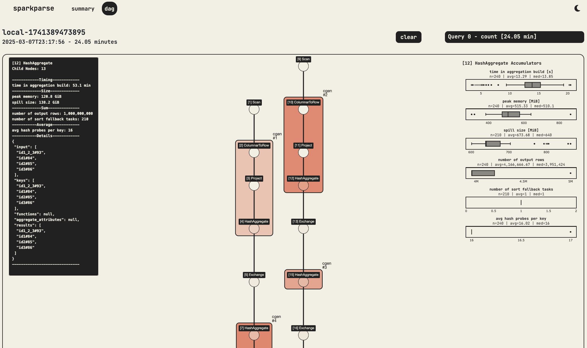

# sparkparse

identify spark bottlenecks without breaking your neck



## what it does

sparkparse parses Apache Spark event logs and provides:

- an interactive Dash dashboard for exploring query plans, stage timelines, and task metrics
- a CLI for parsing logs into structured Polars DataFrames (CSV, Parquet, Delta, JSON output)
- a context manager / decorator for capturing logs from an active SparkSession
- (planned) an `analyze` command that produces structured JSON findings for LLM-assisted analysis

## install

```bash
pip install sparkparse
```

## usage

### CLI

```bash
# parse logs and write output files
sparkparse get --log-dir ./logs --out-format parquet

# launch the dashboard
sparkparse viz --log-dir ./logs

# (planned) produce LLM-friendly analysis JSON
sparkparse analyze --log-dir ./logs
```

### context manager

```python
import sparkparse

with sparkparse.capture_context(spark=spark, action="get") as cap:
    df.groupBy("id").count().show()

parsed = cap._parsed_logs  # ParsedLogDataFrames with .dag and .combined
```

### decorator

```python
import sparkparse

@sparkparse.capture(spark=spark, action="get")
def run_job(spark):
    spark.read.parquet("s3://bucket/data/").groupBy("id").count().show()

result, cap = run_job()
```

## design goals

- simplified UI that highlights bottlenecks and their causes
- node drill-down for detailed information and metric distribution
- generation of base models and DataFrames for extensible analysis
- LLM-friendly analysis output for automated bottleneck detection

## development

See [IMPLEMENTATION.md](IMPLEMENTATION.md) for the planned improvement roadmap.

```bash
# install with dev dependencies
uv sync --dev

# lint + unit tests (excludes Spark-dependent integration tests)
just ci

# full tests including Spark integration tests
just ci-full
```

## TODOs

- [x] structured node details like project columns and scan sources
- [x] task box plots on hover
- [x] metric capture via context manager / decorator
- [ ] hotspot highlighting by metrics other than duration (spill, records, etc.)
- [ ] `analyze` command with LLM-friendly JSON output
- [ ] reading from cloud storage
- [ ] ruff + pyrefly CI
