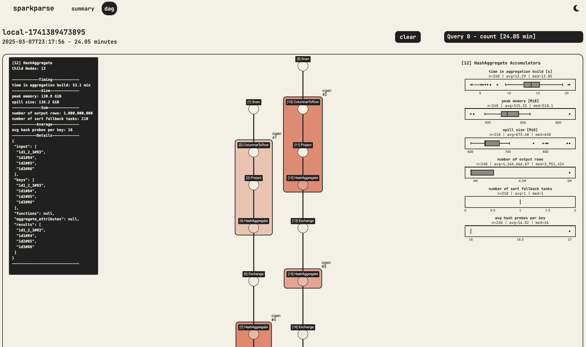

# sparkparse

identify spark bottlenecks without breaking your neck



## what it does

sparkparse parses Apache Spark event logs and provides:

- an interactive Dash dashboard for exploring query plans, stage timelines, and task metrics
- a CLI for parsing logs into structured Polars DataFrames (CSV, Parquet, Delta, JSON output)
- a context manager / decorator for capturing logs from an active SparkSession
- an `analyze` command that emits a raw plan summary (numeric metrics with units)
  plus diagnostic findings, each with its own evidence, thresholds and coverage status

## install

```bash
pip install sparkparse
```

## usage

### CLI

```bash
# list the event-log sources found in a directory
sparkparse logs ./logs

# parse the newest log and write output files
sparkparse get --log-dir ./logs --out-format parquet

# parse one application explicitly (file name, rolling-log dir, or app id)
sparkparse get ./logs --log-file eventlog_v2_app-20260912-0001

# parse every application in the directory
sparkparse get ./logs --all-apps

# launch the dashboard
sparkparse viz --log-dir ./logs

# produce LLM-friendly analysis JSON
sparkparse analyze ./logs

# compact export for long plans, with paths and expressions redacted
sparkparse analyze ./logs --compact --top-n 25 --redact
```

### context manager

```python
import sparkparse

with sparkparse.capture_context(spark=spark, action="get") as cap:
    df.groupBy("id").count().show()

parsed = cap.dfs  # ParsedLogDataFrames with .dag and .combined
result = cap.result  # dataframes, metadata, capabilities, and diagnostics
```

Capture borrows a supplied Spark session and never stops or recreates it. Borrowed
classic sessions must have event logging enabled before the workload starts. When
sparkparse should own a local session, opt in explicitly with
`capture_context(own_session=True)`. Connect captures expose the same result contract,
with unavailable task/stage telemetry called out in `result.capabilities` rather than
represented as zeroes.

### event logs

Rolled logs (`spark.eventLog.rolling.enabled=true`) are read as one logical source
with ordered segments; `.inprogress` logs are read as far as they go and reported as
incomplete. Segments are streamed line by line, never copied into memory whole.
Zstd-compressed logs need `sparkparse[zstd]`; Spark's `lz4`, `lzf` and `snappy`
codecs use Java-specific framing that Python cannot decode, and fail with an error
naming the codec.

Neither `SparkListenerApplicationStart` nor adaptive execution is required. A
non-AQE query keeps the plan from its `SQLExecutionStart` event, a query with no
end event keeps a null duration, and a truncated final line is reported as
truncation rather than corruption. `strict=True` turns those diagnostics into
errors.

Use `backend="classic"` or `backend="connect"` to override detection. For post-run
ingestion without a Spark session, use `backend="event_log", log_file="/path/to/log"`.
Borrowed captures select the current application's log; use an explicit `log_file`
when its filename cannot be identified. They report ambiguous capture scope and
may observe an incomplete log. Owned captures stop their session before parsing.

Capture failures raise by default; `capture_errors="record"` retains diagnostics
and a partial result instead. This is independent of parser `strict=True`. Failed
captures retain their temporary logs. User workload exceptions always take precedence.
`action="viz"` produces an in-memory HTML report in `cap.report`, including coverage,
on either backend; it does not launch a dashboard server. Capture-result JSON uses
Arrow IPC tables to preserve schemas, including empty tables and nested metrics.

### Spark Connect (serverless) capture

Connect capture intercepts the client's action boundaries — `to_table` (`collect`,
`count`, `show`, `take`), `to_pandas`, `to_table_as_iterator`, and `execute_command`
(SQL commands and writes). Each action becomes one query with its own operator
metrics, logical plan, and server operation ID; actions routed through a client
method that the installed version does not expose are reported as
`action_not_covered` diagnostics rather than silently dropped. No extra action is
ever executed to collect telemetry.

```python
import sparkparse

sparkparse.probe_connect_support(spark)  # what this client version exposes
```

Semantics worth knowing:

- `query_duration_seconds` is client-observed elapsed time and includes result
  transfer, so `result.capabilities.query_elapsed_time` is at most `partial`. The
  server's cumulative operator time is kept per node (`cumulTime`, nanoseconds,
  summed over the operator subtree and tasks) and is never used as elapsed time.
- Join keys are attached only when the physical node's plan ID matches a logical
  join relation, when a query contains exactly one join, or when the operator name
  itself carries them. Otherwise keys are left unresolved; they are never matched
  by list position. Child nodes keep the order the server reported and joins record
  `input_roles: unordered` — build and probe sides are not asserted.
- Unrecognized operators are preserved as `Unknown` nodes with their raw names and
  graph edges intact, unless `strict=True` is set. Metric batches are treated as
  snapshots (last value per plan ID wins), never summed.
- One client supports one capture at a time; a nested or concurrent capture on the
  same client is rejected, and overlapping actions across threads are attributed by
  calling thread and flagged with a `concurrent_executions` diagnostic.
- Task and stage telemetry is unavailable on this source and is reported as such in
  `result.capabilities` instead of as zeroes.

Recorded executions can be replayed offline with
`SparkConnectCapture.from_plan_metrics(executions)`, where each entry carries the
`PlanMetrics.to_dict()` payload.

### decorator

```python
import sparkparse

@sparkparse.capture(spark=spark, action="get")
def run_job(spark):
    spark.read.parquet("s3://bucket/data/").groupBy("id").count().show()

result, cap = run_job()
```

## design goals

- simplified UI that highlights bottlenecks and their causes
- node drill-down for detailed information and metric distribution
- generation of base models and DataFrames for extensible analysis
- LLM-friendly analysis output for automated bottleneck detection

## development

See the [September 2026 review and implementation queue](plans/improvements-2026-09/README.md)
for prioritized standard/serverless parity and developer experience improvements.
[IMPLEMENTATION.md](IMPLEMENTATION.md) contains the earlier roadmap.

```bash
# install with dev dependencies
uv sync --dev

# lint + unit tests (excludes Spark-dependent integration tests)
just ci

# full tests including Spark integration tests
just ci-full
```

## TODOs

- [x] structured node details like project columns and scan sources
- [x] task box plots on hover
- [x] metric capture via context manager / decorator
- [ ] hotspot highlighting by metrics other than duration (spill, records, etc.)
- [x] `analyze` command with LLM-friendly JSON output
- [ ] reading from cloud storage
- [ ] ruff + pyrefly CI
